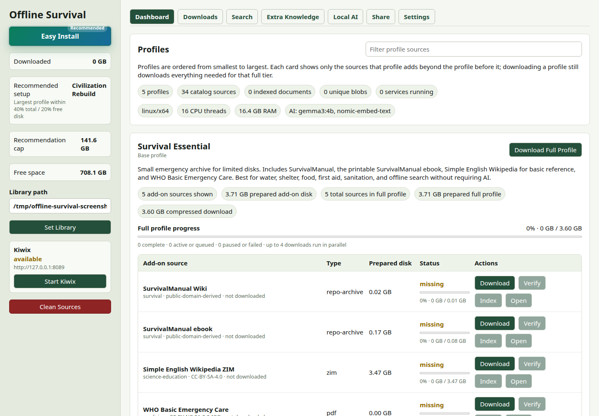
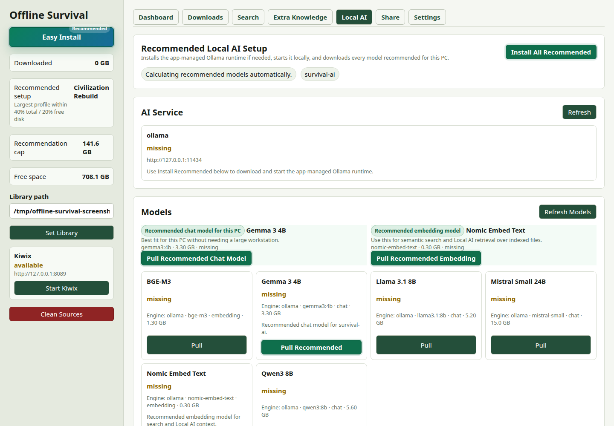
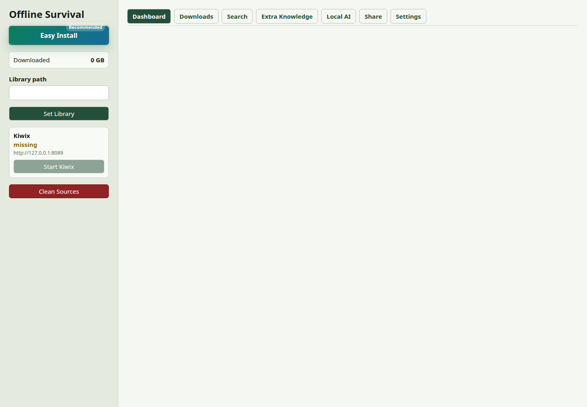

# Offline Survival

Build a private offline knowledge library for emergencies, travel, field work, classrooms, and unreliable networks.

Offline Survival is a desktop app that downloads useful public knowledge packs, keeps them on your computer, indexes them for search, and can optionally run a local AI assistant over the material. It is designed so a non-technical person can choose a library size, press **Download**, and later search or share that library without needing the internet.



## Contents

- [What It Does](#what-it-does)
- [Download The App](#download-the-app)
- [First Run](#first-run)
- [Choosing A Library Size](#choosing-a-library-size)
- [Search And Local AI](#search-and-local-ai)
- [Sharing An Offline Library](#sharing-an-offline-library)
- [What Gets Downloaded](#what-gets-downloaded)
- [Privacy And Safety](#privacy-and-safety)
- [For Developers](#for-developers)
- [Releases](#releases)

## What It Does

Offline Survival helps you create a local library with material such as:

- survival manuals and first-aid references
- Simple English Wikipedia and selected Wikipedia collections
- medicine, repair, farming, engineering, cooking, maps, textbooks, and practical how-to archives
- your own extra PDFs, EPUBs, Markdown, HTML, CSV, JSON, text files, and ZIM files

The app keeps the original files, prepares readable copies when needed, builds a local search index, and can package the result for another computer.

## Download The App

Go to the latest release:

<https://github.com/carlospolop/offline-survival/releases/latest>

Download the file for your computer:

| Your computer | Download |
| --- | --- |
| Windows | `Offline-Survival-windows-x64` or `Offline-Survival-windows-arm64` |
| macOS Intel | `Offline-Survival-macos-x64` |
| macOS Apple Silicon | `Offline-Survival-macos-arm64` |
| Linux Intel/AMD | `Offline-Survival-linux-x64` |
| Linux ARM | `Offline-Survival-linux-arm64` |

The release also includes an `Offline-Survival-all-platforms` archive. That bundle is useful when preparing a USB drive for mixed Windows, macOS, and Linux machines.

## First Run

1. Open Offline Survival.
2. Choose a **Library path**. This is where downloaded knowledge files will live.
3. Press **Easy Install** if you want the recommended setup for your computer.
4. Leave the app open while it downloads, verifies, prepares, and indexes files.

The app does not upload your library. Downloaded files stay in the folder you choose.

## Choosing A Library Size

The profiles are ordered from small to large:

| Profile | Best for |
| --- | --- |
| Survival Essential | Small emergency library for limited disks. |
| Survival Plus | More reference material without going huge. |
| Civilization Core | A serious practical library for long offline periods. |
| Civilization Rebuild | Repair, engineering, science, and broader rebuilding material. |
| Civilization Max | The largest catalog option for big disks. |

The sidebar recommends the largest profile that fits a conservative disk budget for the current machine.

## Search And Local AI

Search works after sources are indexed. Local AI is optional.



The Local AI panel can install a small chat model and an embedding model. Startup is protected by a RAM guard:

- the app checks available RAM before starting Ollama
- the check depends on the installed chat model
- if the machine is under memory pressure, Local AI stays blocked instead of freezing the computer
- normal search still works without AI

Local AI answers are grounded in indexed local sources. For medical, electrical, structural, chemical, or other high-risk topics, treat the answer as a pointer back to the cited source, not as professional advice.

## Sharing An Offline Library

The **Share** tab builds a portable package with the selected downloaded sources and app files.



Use this for:

- copying a prepared library to a USB drive
- moving the app to a computer with no internet
- preparing a classroom, clinic, workshop, or field laptop

The GitHub release workflow also creates a combined all-platforms release bundle so future sharing flows can include launchers for Windows, macOS, and Linux from the same release set.

## What Gets Downloaded

The catalog is defined in [manifests/sources/catalog.yaml](manifests/sources/catalog.yaml). It stores source URLs, sizes, licenses, categories, and profiles. The repository stores the catalog and app code only.

The repository must not contain downloaded ZIMs, PDFs, archives, model files, local SQLite state, or generated release bundles. Those are ignored by `.gitignore`.

## Privacy And Safety

- Your downloaded library is local.
- Search indexes are local.
- Extra knowledge files are copied into your selected library path before indexing.
- Local AI runs through a local Ollama runtime when installed.
- The app binds its internal services to localhost by default.
- RAM checks prevent Local AI from starting when the selected model is unsafe for the current machine.

## For Developers

Requirements:

- Node.js 22+
- npm
- Rust and Cargo
- platform dependencies for Tauri

Install and validate:

```bash
npm ci
npm run validate
```

Run the web UI and backend during development:

```bash
npm run api
npm run dev
```

Build the desktop app locally:

```bash
npm run build
npm run sidecars:prepare
npm run tauri:build
```

The sidecar script prepares platform-specific backend binaries under `app/src-tauri/binaries/`. Those files are generated and ignored.

## Releases

Releases are built by GitHub Actions from tags like:

```bash
git tag v0.1.0
git push origin v0.1.0
```

The release workflow builds Windows, macOS, and Linux packages for x64 and arm64 where GitHub-hosted runners are available, uploads each platform artifact, and creates an all-platforms archive.

The GitHub Pages site is published from `site/` and is available at:

<https://carlospolop.github.io/offline-survival/>
